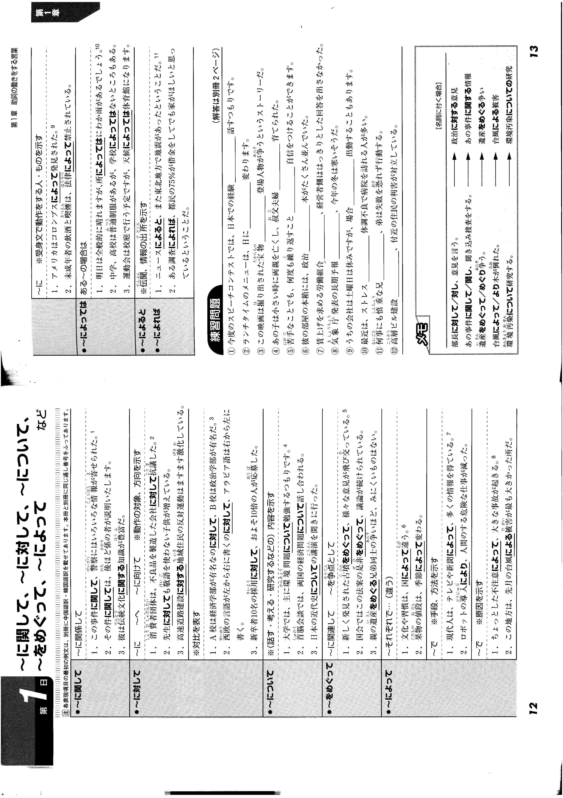

# 1

- aiueo aiueo
<input type="radio" name="q1" value="はい"> はい
<input type="radio" name="q1" value="いいえ"> いいえ

- abcde abcde
<input type="radio" name="q2" value="はい"> はい
<input type="radio" name="q2" value="いいえ" checked> いいえ

「いいえ」を無効化 
<input type="radio" name="q3" value="はい"> はい
<input type="radio" name="q3" value="いいえ" disabled> いいえ

<button type=button onclick="location.href='./2'">
  送信
</button>

- aaa
