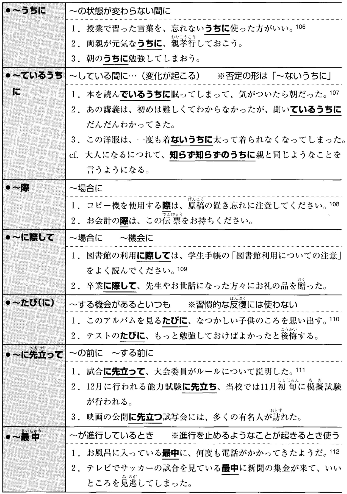
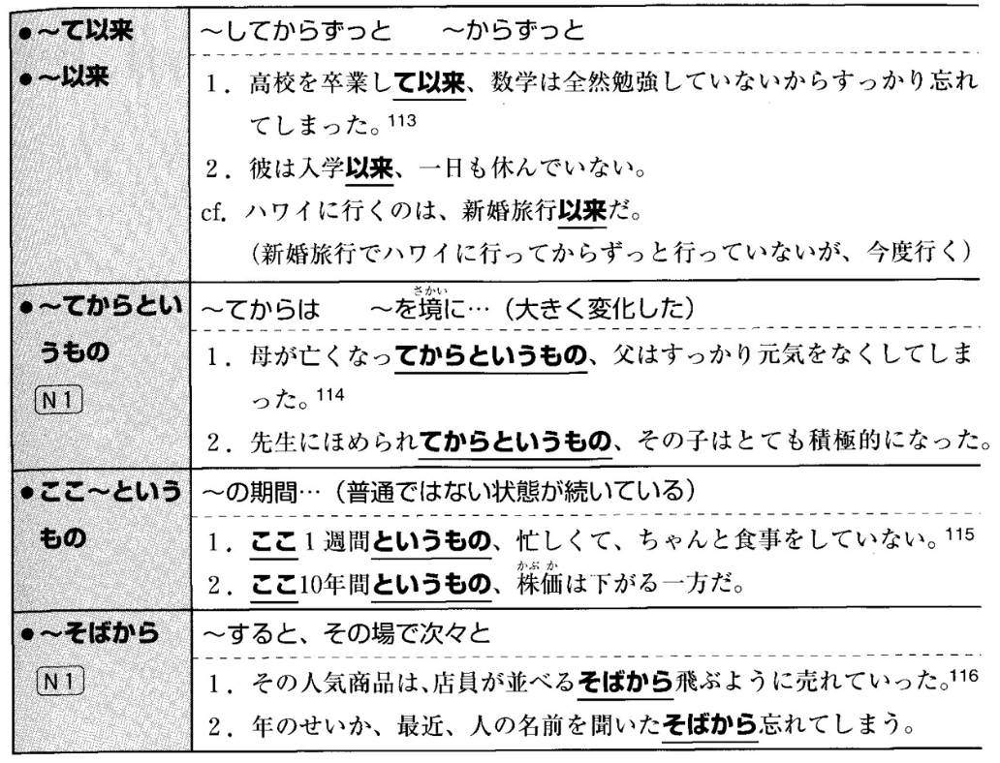
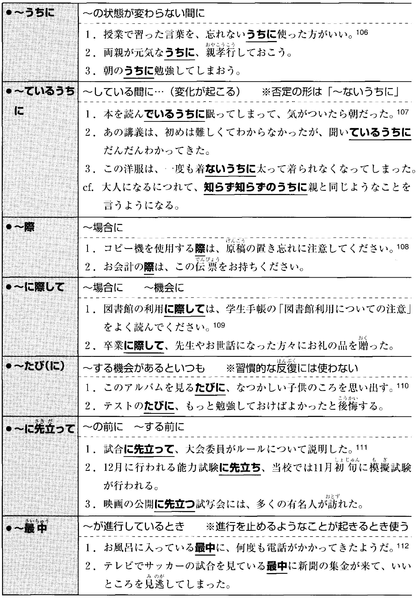
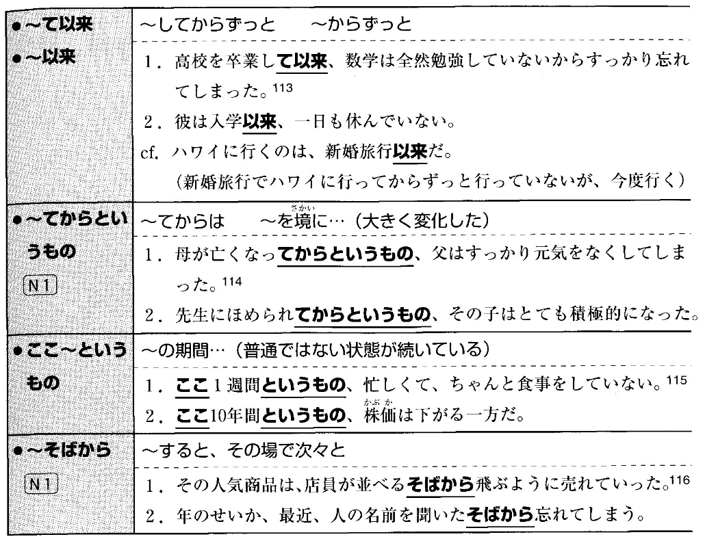

# 1

資料を参考に、空欄をを埋めるのに適した選択肢を選んでください。

- 調査の結果が _____ 次第、連絡いたします。  
<input type="radio" name="2" value="1"> わかって  
<input type="radio" name="2" value="2"> わかり  
<input type="radio" name="2" value="3"> わかる  
<input type="radio" name="2" value="4"> わかった  

- 子供は学校から _____  なり、ゲームをやり始めた。   
<input type="radio" name="4" value="1"> 帰ってき 
<input type="radio" name="4" value="2"> 帰ってきて
<input type="radio" name="4" value="3"> 帰ってくる
<input type="radio" name="4" value="4"> 帰ってきた

- 彼はよほど急いでいたらしく、エレベーターのドアが開く _____ 外に飛び出した。   
<input type="radio" name="5" value="1"> かと思うと
<input type="radio" name="5" value="2"> うちに
<input type="radio" name="5" value="3"> とたん
<input type="radio" name="5" value="4"> や否や

- 赤ちゃんは、今泣いていた _____  もう笑っている。
<input type="radio" name="11" value="1"> と思いながら
<input type="radio" name="11" value="2"> と思って
<input type="radio" name="11" value="3"> かと思い
<input type="radio" name="11" value="4"> かと思ったら

- ご来場有難うございました。お帰りの _____  受付にて粗品をお受け取りください。
<input type="radio" name="10" value="1"> 際に
<input type="radio" name="10" value="2"> たびに
<input type="radio" name="10" value="3"> 最中に
<input type="radio" name="10" value="4"> うちに

- この映画は、何度見ても見る _____  感動させられる。
<input type="radio" name="12" value="1"> たびに
<input type="radio" name="12" value="2"> うちに
<input type="radio" name="12" value="3"> 際に
<input type="radio" name="12" value="4"> 最中に

- 彼は5年前に事故を起こして以来、 _____ 。
<input type="radio" name="13" value="1"> これからも運転するつもりだ
<input type="radio" name="13" value="2"> 二度と運転しないだろう
<input type="radio" name="13" value="3"> 一度も運転していない
<input type="radio" name="13" value="4"> 一度運転した

- この仕事は、最初はつまらないと思ったが、やっているうちに _____  。
<input type="radio" name="13" value="1"> おもしろいだろう
<input type="radio" name="13" value="2"> おもしろくなってきた
<input type="radio" name="13" value="3"> おもしろかった
<input type="radio" name="13" value="4"> おもしろいと思う

<button type="button" onclick="location.href='./2'">送信</button>
