# 1

補助資料を参考に、空欄をを埋めるのに適した選択肢を選んでください。  

  
  
  
  
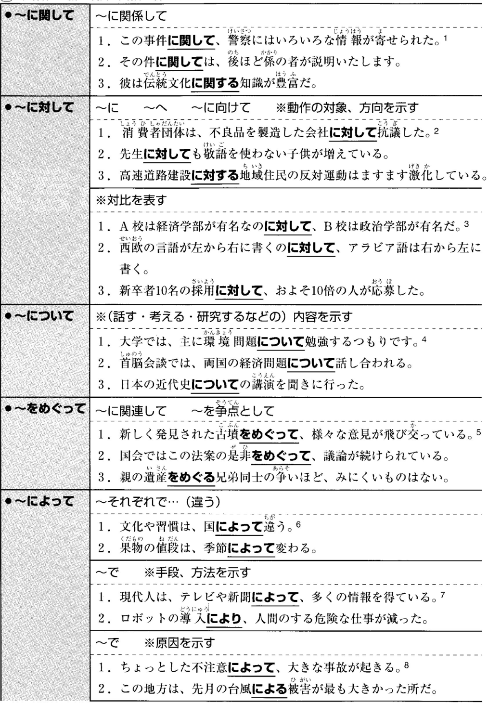  
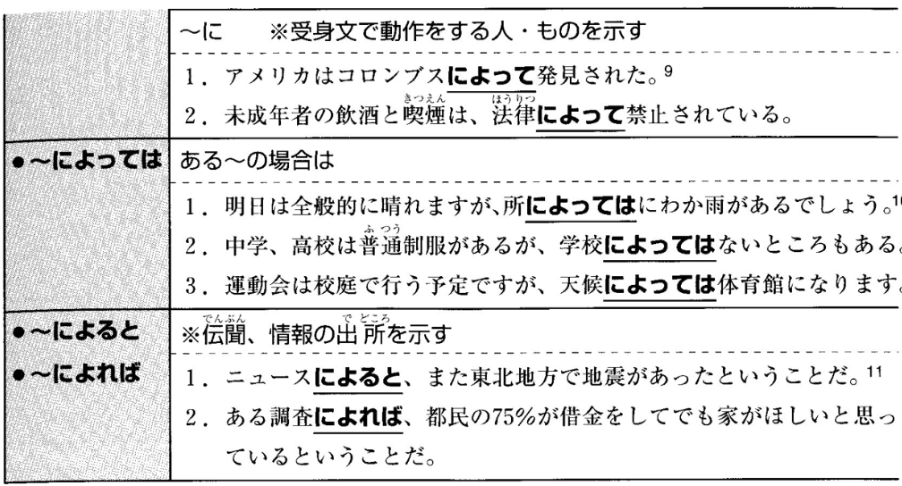  
補助資料 1

- 調査の結果が \_\_\_\_\_ 次第、連絡いたします。  
<input type="radio" name="1" value="1"> わかって  
<input type="radio" name="1" value="2"> わかり  
<input type="radio" name="1" value="3"> わかる  
<input type="radio" name="1" value="4"> わかった  

- 子供は学校から \_\_\_\_\_  なり、ゲームをやり始めた。   
<input type="radio" name="2" value="1"> 帰ってき  
<input type="radio" name="2" value="2"> 帰ってきて  
<input type="radio" name="2" value="3"> 帰ってくる  
<input type="radio" name="2" value="4"> 帰ってきた  

- 彼はよほど急いでいたらしく、エレベーターのドアが開く \_\_\_\_\_ 外に飛び出した。   
<input type="radio" name="3" value="1"> かと思うと  
<input type="radio" name="3" value="2"> うちに  
<input type="radio" name="3" value="3"> とたん  
<input type="radio" name="3" value="4"> や否や  

- 赤ちゃんは、今泣いていた \_\_\_\_\_  もう笑っている。  
<input type="radio" name="4" value="1"> と思いながら  
<input type="radio" name="4" value="2"> と思って  
<input type="radio" name="4" value="3"> かと思い  
<input type="radio" name="4" value="4"> かと思ったら  

- ご来場有難うございました。お帰りの \_\_\_\_\_  受付にて粗品をお受け取りください。  
<input type="radio" name="5" value="1"> 際に  
<input type="radio" name="5" value="2"> たびに  
<input type="radio" name="5" value="3"> 最中に  
<input type="radio" name="5" value="4"> うちに  

- この映画は、何度見ても見る \_\_\_\_\_  感動させられる。  
<input type="radio" name="6" value="1"> たびに  
<input type="radio" name="6" value="2"> うちに  
<input type="radio" name="6" value="3"> 際に  
<input type="radio" name="6" value="4"> 最中に  

- 彼は5年前に事故を起こして以来、 \_\_\_\_\_ 。  
<input type="radio" name="7" value="1"> これからも運転するつもりだ  
<input type="radio" name="7" value="2"> 二度と運転しないだろう  
<input type="radio" name="7" value="3"> 一度も運転していない  
<input type="radio" name="7" value="4"> 一度運転した  

- この仕事は、最初はつまらないと思ったが、やっているうちに \_\_\_\_\_  。  
<input type="radio" name="8" value="1"> おもしろいだろう  
<input type="radio" name="8" value="2"> おもしろくなってきた  
<input type="radio" name="8" value="3"> おもしろかった  
<input type="radio" name="8" value="4"> おもしろいと思う  

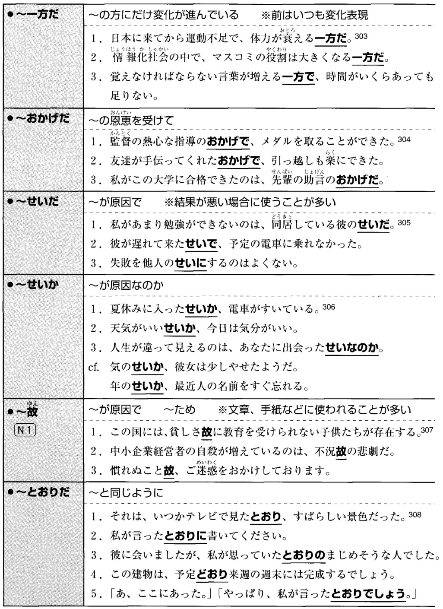  
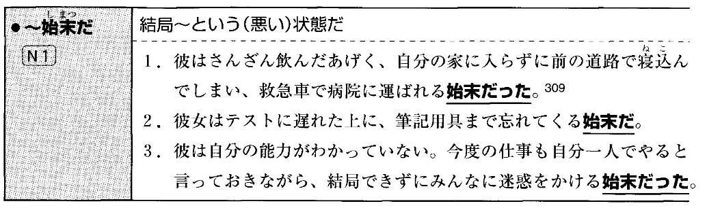  
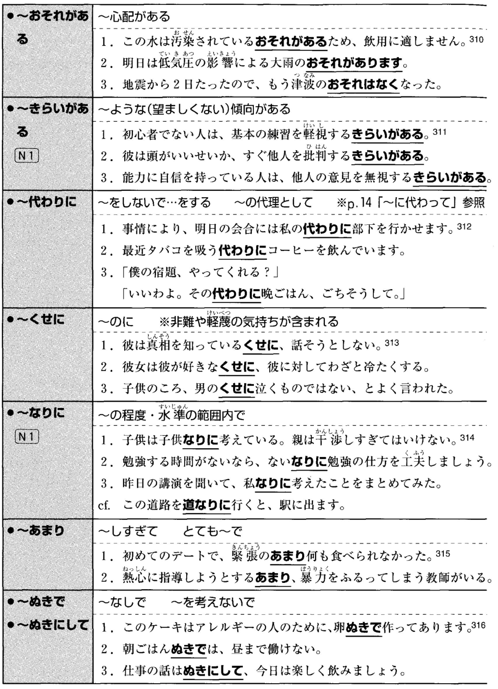  
  
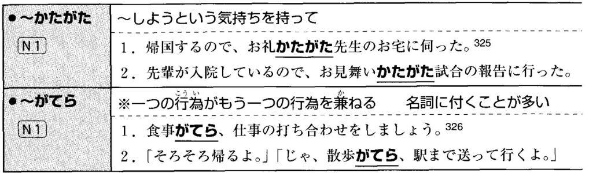  
  
補助資料 2

- この病気は広い地域に伝染する \_\_\_\_\_ があるから、早く手を打たなければならない。  
<input type="radio" name="9" value="1">きらい     
<input type="radio" name="9" value="2">故  
<input type="radio" name="9" value="3">おそれ  
<input type="radio" name="9" value="4">始末  

- 日本は経済的発展を追求する \_\_\_\_\_ 環境保護対策が遅れてしまった。  
<input type="radio" name="a" value="1">くせに  
<input type="radio" name="a" value="2">なりに  
<input type="radio" name="a" value="3">かたがた  
<input type="radio" name="a" value="4">あまり   

- 世界平和を実現できるかどうかは、私たち人間 \_\_\_\_\_ なのです。  
<input type="radio" name="b" value="1">始末  
<input type="radio" name="b" value="2">次第  
<input type="radio" name="b" value="3">一方  
<input type="radio" name="b" value="4">故に  

- 人から見るとのんびりしているようでも、彼は彼 \_\_\_\_\_ がんばっているのだ。  
<input type="radio" name="c" value="1">なりに  
<input type="radio" name="c" value="2">わりに   
<input type="radio" name="c" value="3">かわりに  
<input type="radio" name="c" value="4">ぬきに  

- 彼は問題解決のための努力を何もしていない \_\_\_\_\_ 、口だけは出す。  
<input type="radio" name="d" value="1">せいで  
<input type="radio" name="d" value="2">せいか  
<input type="radio" name="d" value="3">くせに  
<input type="radio" name="d" value="4">とおり  

- 雨が降っている \_\_\_\_\_ 、今日はお客様が少ないですね。  
<input type="radio" name="e" value="1">せいか  
<input type="radio" name="e" value="2">なりに  
<input type="radio" name="e" value="3">くせに  
<input type="radio" name="e" value="4">とおり  

- 勉強しているつもりなのに、成績が \_\_\_\_\_ 一方だ。  
<input type="radio" name="f" value="1">悪い  
<input type="radio" name="f" value="2">下がる  
<input type="radio" name="f" value="3">下げる  
<input type="radio" name="f" value="4">下がった  

- どこのキャンパスも桜が満開らしい。花見 \_\_\_\_\_ 大学の見学でもして来よう。  
<input type="radio" name="g" value="1">次第で  
<input type="radio" name="g" value="2">なりに  
<input type="radio" name="g" value="3">とおり  
<input type="radio" name="g" value="4">がてら  

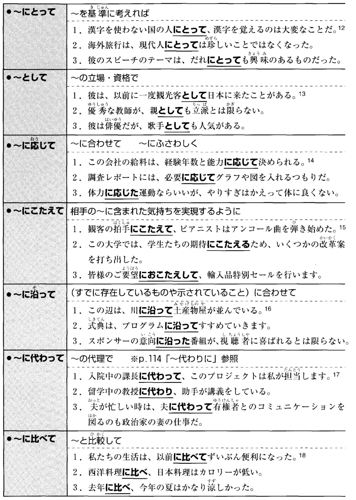  
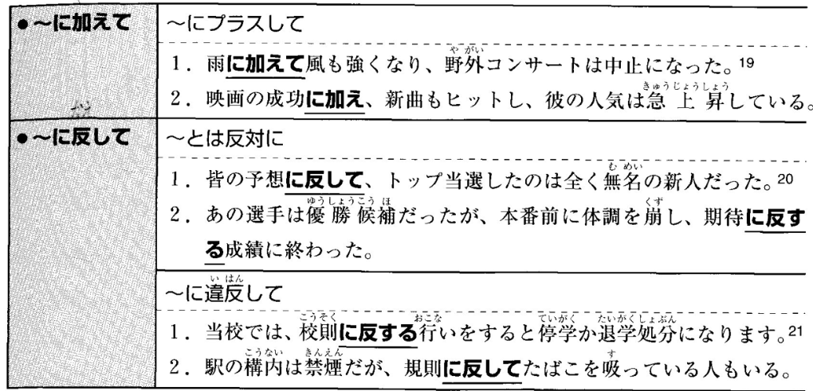  
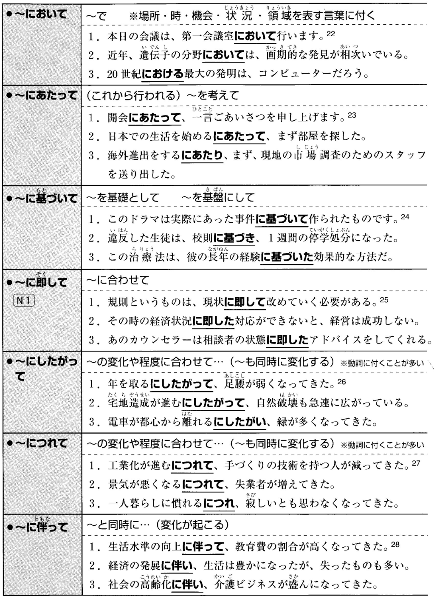  
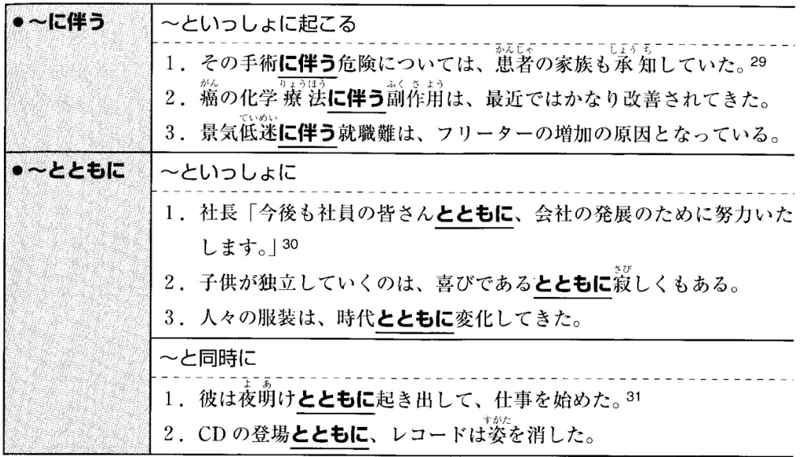  
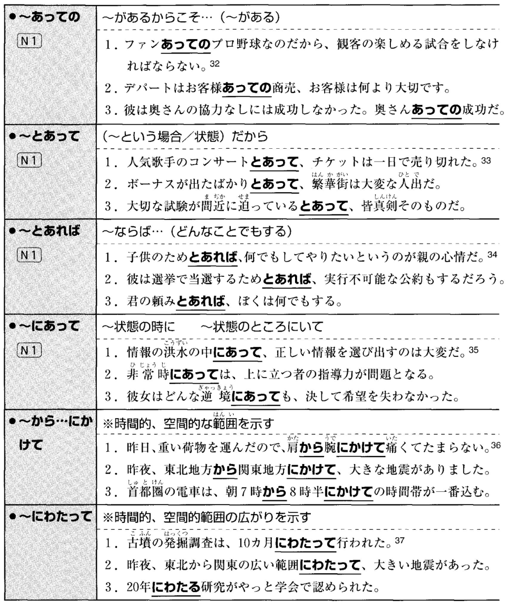  
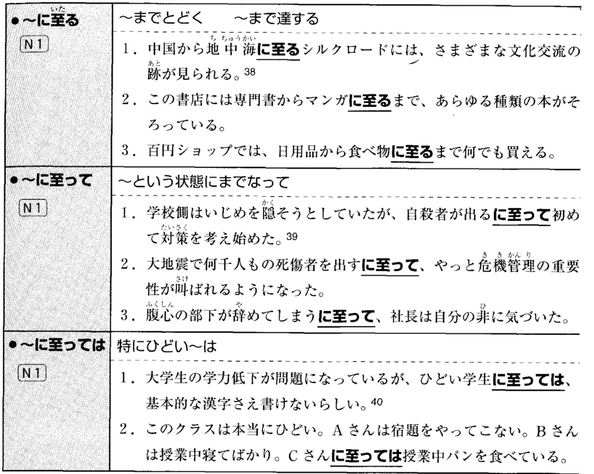  
補助資料 3

- このレストランはあまりきれいとは言えないが、味 \_\_\_\_\_ はこの辺では一番だ。  
<input type="radio" name="h" value="1">として  
<input type="radio" name="h" value="2">にかけて  
<input type="radio" name="h" value="3">につれて  
<input type="radio" name="h" value="4">に沿って  

- 会社の規模が拡大するに \_\_\_\_\_ 、以前のような家庭的な雰囲気はなくなってきた。  
<input type="radio" name="i" value="1">したがって  
<input type="radio" name="i" value="2">ともに  
<input type="radio" name="i" value="3">あたって  
<input type="radio" name="i" value="4">比べ  

- 国土開発に \_\_\_\_\_ 自然破壊をこれ以上進ませてはならない。  
<input type="radio" name="j" value="1">基づく  
<input type="radio" name="j" value="2">伴う  
<input type="radio" name="j" value="3">反する  
<input type="radio" name="j" value="4">通じる  

- では、パンフレットに \_\_\_\_\_ 説明をしていきます。  
<input type="radio" name="k" value="1">沿って  
<input type="radio" name="k" value="2">応じて  
<input type="radio" name="k" value="3">つれて  
<input type="radio" name="k" value="4">至って  

- このビールはアルコール度が低いお酒 \_\_\_\_\_ ジュースという感じだ。  
<input type="radio" name="l" value="1">にもまして  
<input type="radio" name="l" value="2">と相まって  
<input type="radio" name="l" value="3">に代わって  
<input type="radio" name="l" value="4">というより  

- 彼女の作品には、優れた技術に \_\_\_\_\_ 若々しさも感じられる。  
<input type="radio" name="m" value="1">通して  
<input type="radio" name="m" value="2">加えて  
<input type="radio" name="m" value="3">込めて  
<input type="radio" name="m" value="4">対して  

- 調査の結果は、我々の予想に \_\_\_\_\_ あまり望ましいものではなかった。  
<input type="radio" name="n" value="1">応じて  
<input type="radio" name="n" value="2">伴って  
<input type="radio" name="n" value="3">通じて  
<input type="radio" name="n" value="4">反して  

- わが社では新しい商品の開発を進める \_\_\_\_\_ 、研究者の育成にも力を入れている。  
<input type="radio" name="o" value="1">とともに  
<input type="radio" name="o" value="2">につれて  
<input type="radio" name="o" value="3">において  
<input type="radio" name="o" value="4">に沿って  

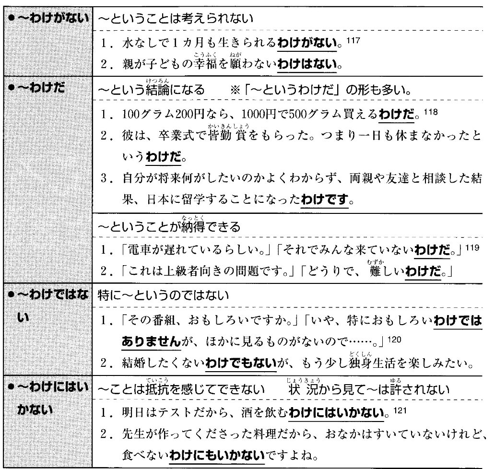  
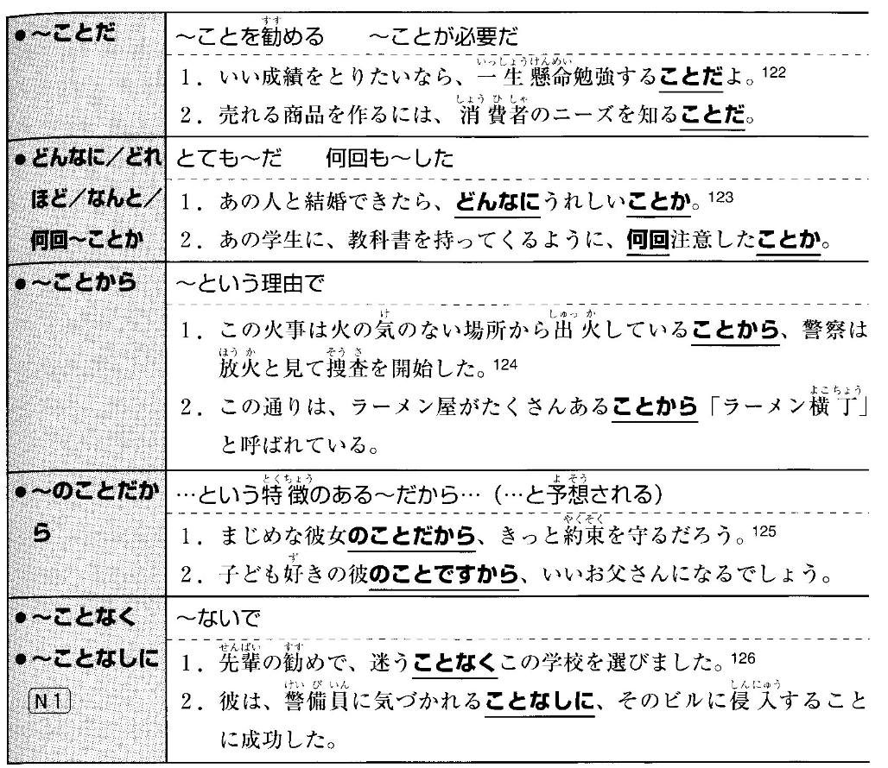  
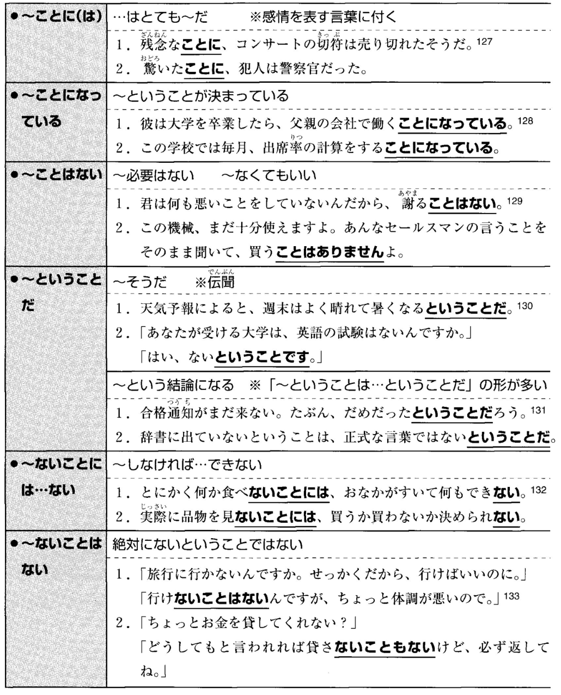  
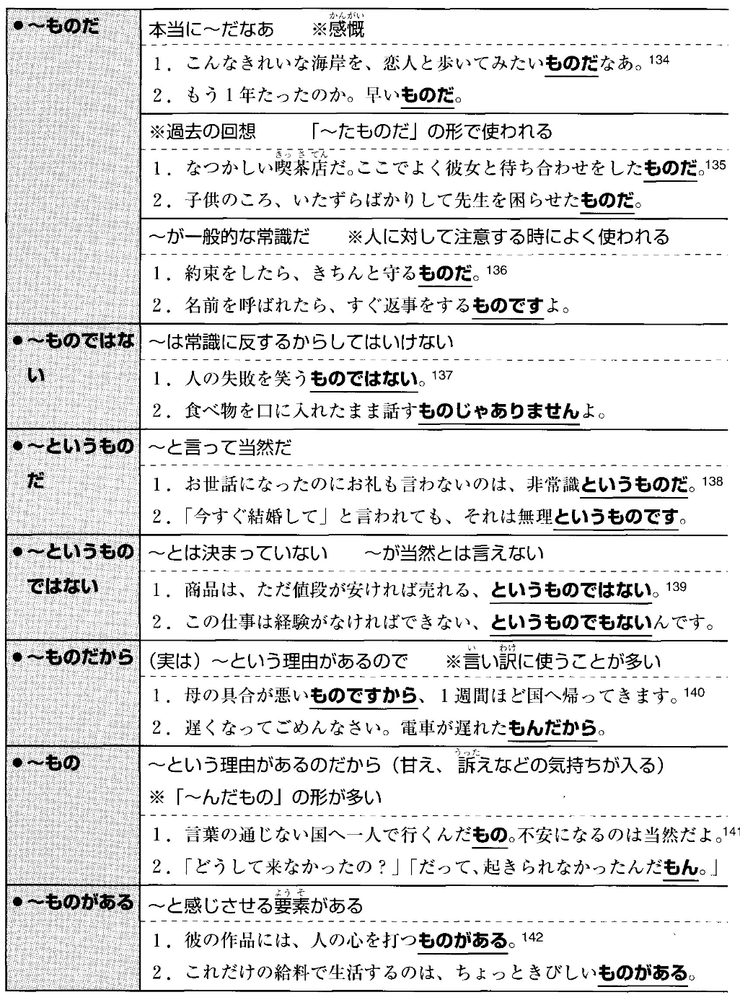  
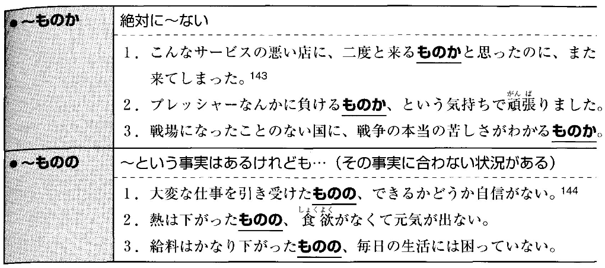  
補助資料 4

- 私が料理を作れる \_\_\_\_\_ がないでしょう。  コーヒーも入れたことがないのに。  
<input type="radio" name="1" value="1">もの  
<input type="radio" name="1" value="2">わけ  
<input type="radio" name="1" value="3">こと  
<input type="radio" name="1" value="4">ところ  

- 彼を傷つけたことがそんなに気になるのなら、早く謝ってしまう \_\_\_\_\_ だ。  
<input type="radio" name="2" value="1">わけ  
<input type="radio" name="2" value="2">もの  
<input type="radio" name="2" value="3">ところ  
<input type="radio" name="2" value="4">こと  

- 多数の食中毒患者が出た \_\_\_\_\_ 、学校給食はしばらく中止となった。  
<input type="radio" name="3" value="1">ことには  
<input type="radio" name="3" value="2">ことだから  
<input type="radio" name="3" value="3">ことから  
<input type="radio" name="3" value="4">ことなく  

- この成績で国立大学に合格するのは、ちょっときびしい \_\_\_\_\_ がある。  
<input type="radio" name="4" value="1">もの  
<input type="radio" name="4" value="2">こと  
<input type="radio" name="4" value="3">わけ  
<input type="radio" name="4" value="4">ところ  

- 彼の意見に一度は賛成した \_\_\_\_\_ 、どうも納得できないところがある。   
<input type="radio" name="5" value="1">ことが  
<input type="radio" name="5" value="2">ものの  
<input type="radio" name="5" value="3">ものが  
<input type="radio" name="5" value="4">ことに  

- 困った \_\_\_\_\_ 、大事な書類をタクシーの中に忘れてしまった。  
<input type="radio" name="6" value="1">ものに  
<input type="radio" name="6" value="2">ものを  
<input type="radio" name="6" value="3">ことに  
<input type="radio" name="6" value="4">ことが  

- やれば \_\_\_\_\_ もないとは思いますが、かなり大変ですよ。  
<input type="radio" name="7" value="1">できないもの  
<input type="radio" name="7" value="2">できるもの  
<input type="radio" name="7" value="3">できないこと  
<input type="radio" name="7" value="4">できること  

- とにかく模擬試験を受けて \_\_\_\_\_ ことには、実力がわからないでしょう。  
<input type="radio" name="8" value="1">みる  
<input type="radio" name="8" value="2">みない  
<input type="radio" name="8" value="3">みた  
<input type="radio" name="8" value="4">みて  

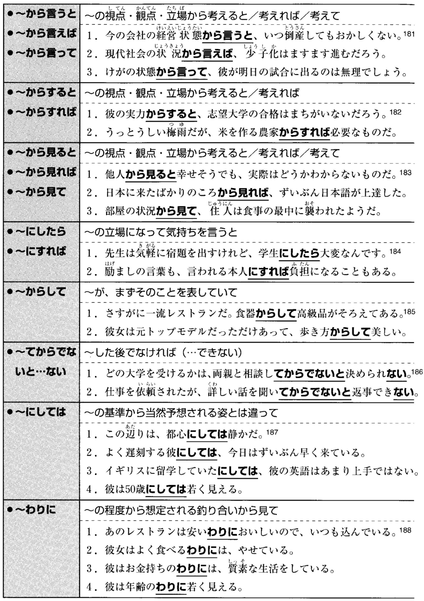  
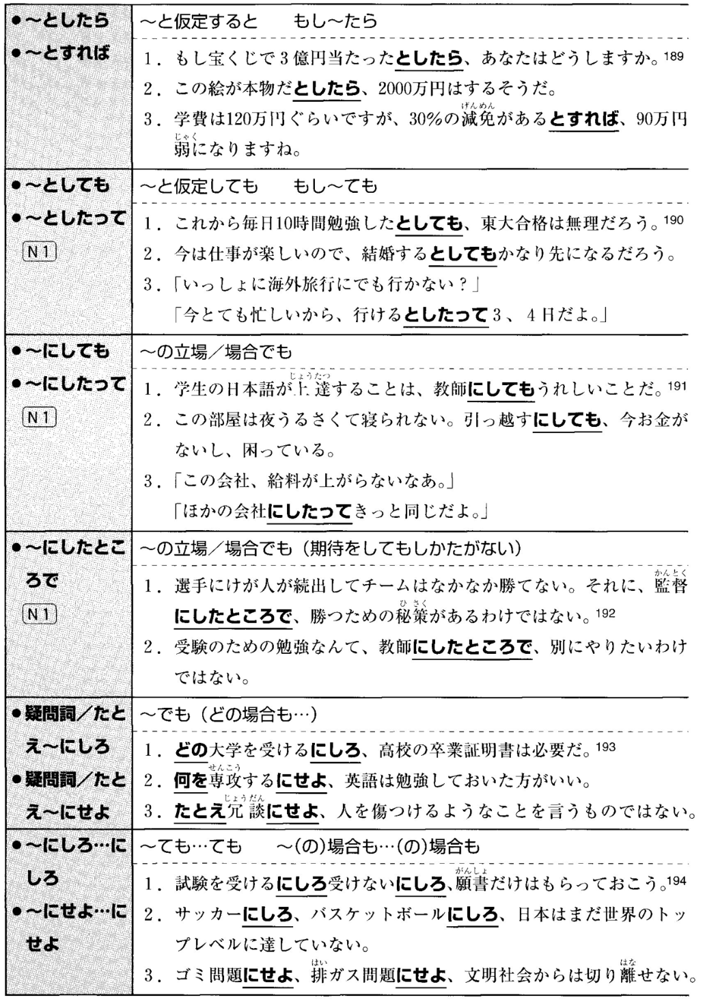  
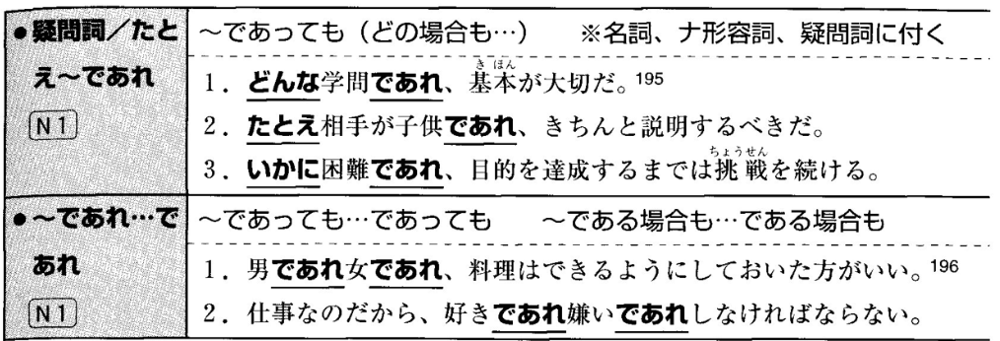  
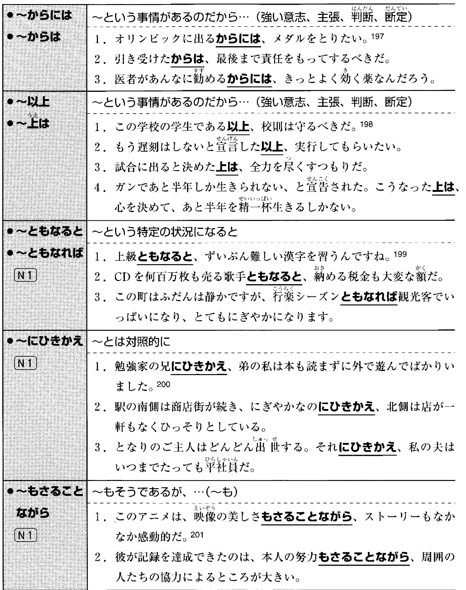  
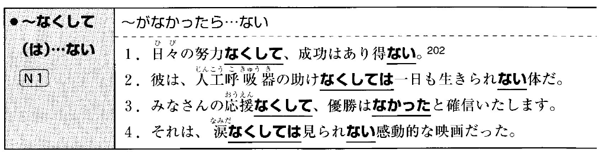  
補助資料 5

- 彼がそこまではっきり言う \_\_\_\_\_ 、よほど自身があるんだろう。   
<input type="radio" name="9" value="1">から言えば  
<input type="radio" name="9" value="2">から見て  
<input type="radio" name="9" value="3">からして  
<input type="radio" name="9" value="4">からには  

- 彼は、日本に来てまだ半年 \_\_\_\_\_ 、日本の生活にとけこんでいる。  
<input type="radio" name="a" value="1">といっても  
<input type="radio" name="a" value="2">というと  
<input type="radio" name="a" value="3">にしては  
<input type="radio" name="a" value="4">にすれば  

- 彼の現在の健康状態 \_\_\_\_\_ 長期の旅行は無理だろう。  
<input type="radio" name="b" value="1">としたら  
<input type="radio" name="b" value="2">から言って  
<input type="radio" name="b" value="3">にしては  
<input type="radio" name="b" value="4">もさることながら  

- 納豆は苦手です。  あのにおい \_\_\_\_\_ どうもねえ。  
<input type="radio" name="c" value="1">からは  
<input type="radio" name="c" value="2">というと  
<input type="radio" name="c" value="3">からして  
<input type="radio" name="c" value="4">にしたら  

- 娘を遠い外国へ留学させるのは、親 \_\_\_\_\_ 本当に心配なことだろう。  
<input type="radio" name="d" value="1">にしたら  
<input type="radio" name="d" value="2">にしては  
<input type="radio" name="d" value="3">なくして  
<input type="radio" name="d" value="4">にひきかえ  

- 新曲は、販売初日の売れ行き \_\_\_\_\_ 大ヒットまちがいなしだろう。  
<input type="radio" name="e" value="1">としたら  
<input type="radio" name="e" value="2">というと  
<input type="radio" name="e" value="3">からには  
<input type="radio" name="e" value="4">から見て  

- あの人が責任を持ってこの仕事を引き受けてくれた以上、 \_\_\_\_\_ 。  
<input type="radio" name="f" value="1">全面的にはまかせられない  
<input type="radio" name="f" value="2">全面的にまかせるべきだ  
<input type="radio" name="f" value="3">私にとってうれしいことだ  
<input type="radio" name="f" value="4">私にとって困ることになる  

- 毎日は無理 \_\_\_\_\_ 1週間に1回ぐらいは電話してほしい。  
<input type="radio" name="g" value="1">にとって  
<input type="radio" name="g" value="2">にしろ  
<input type="radio" name="g" value="3">にして  
<input type="radio" name="g" value="4">にしたら  

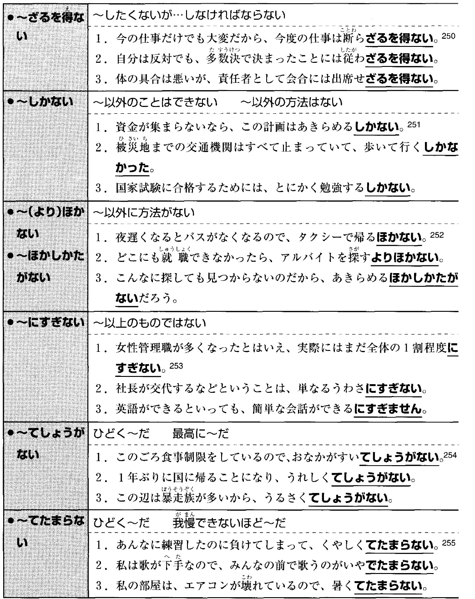  
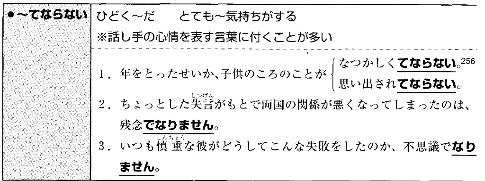  
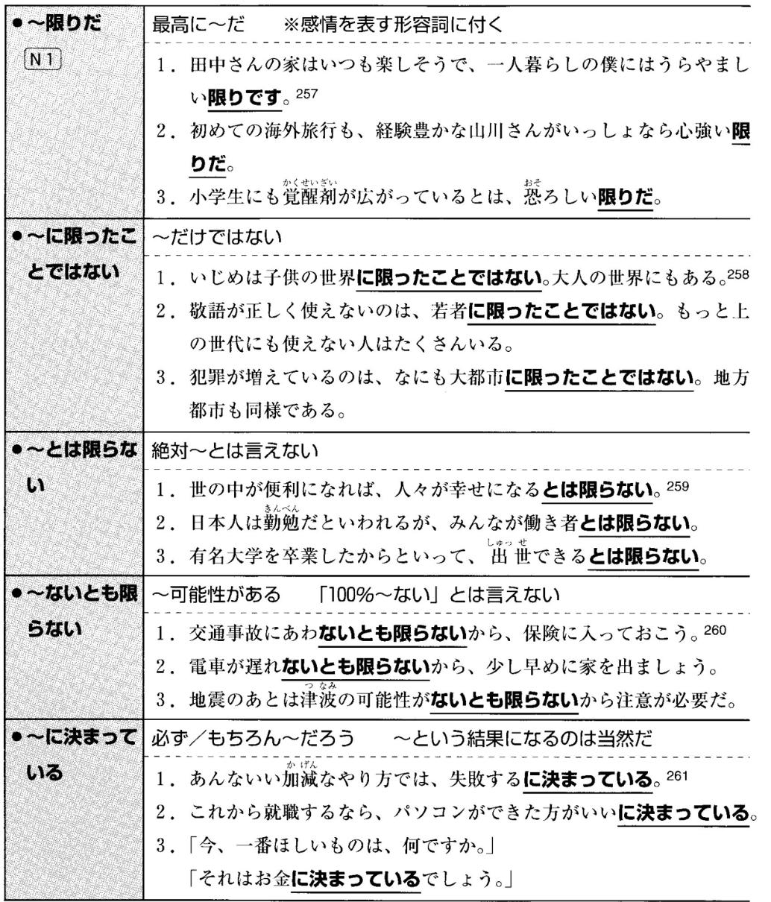  
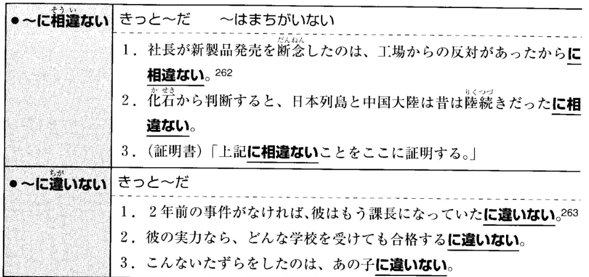  
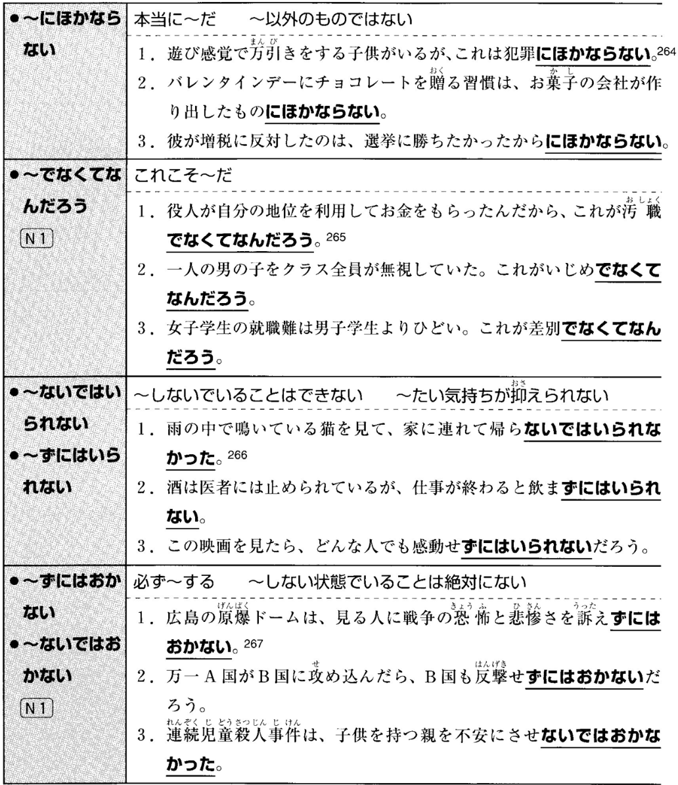  
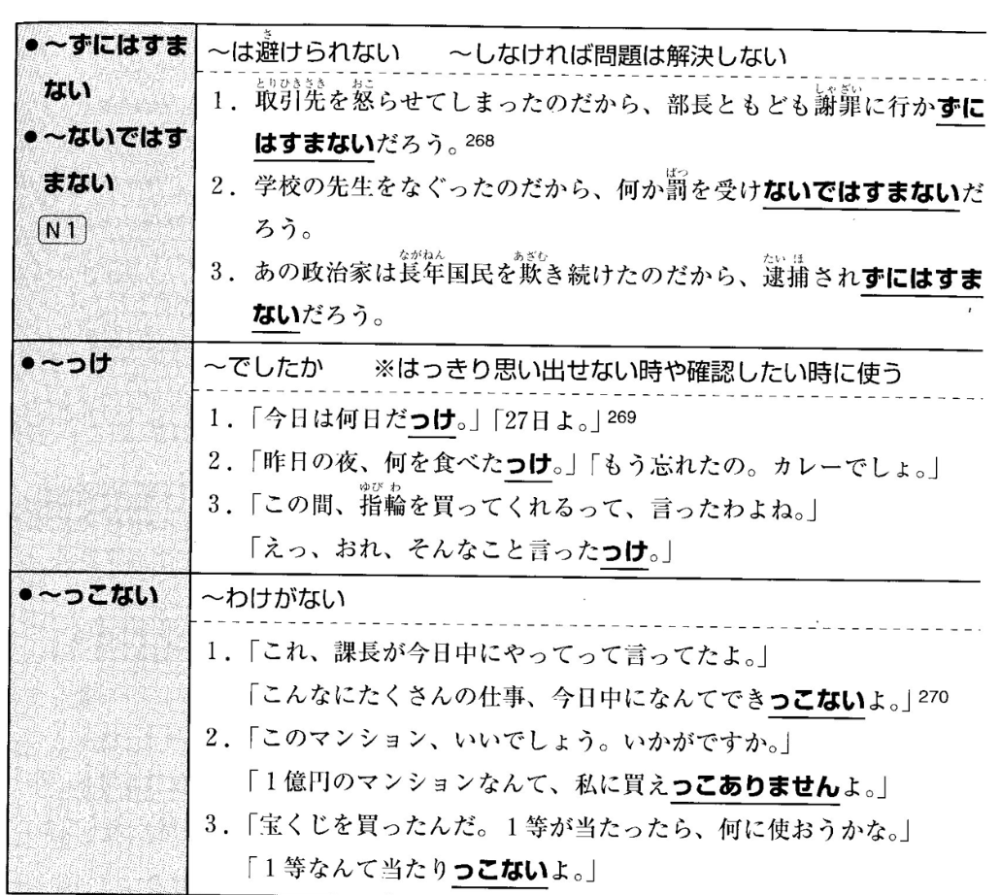 
補助資料 6

- 指導のためとはいっても、体罰は暴力に \_\_\_\_\_ 。  
<input type="radio" name="h" value="1">あたらない  
<input type="radio" name="h" value="2">ほかない  
<input type="radio" name="h" value="3">ほかならない  
<input type="radio" name="h" value="4">決まっていない  

- その選手の素晴らしいジャンプは、観客を驚嘆させ \_\_\_\_\_ 。  
<input type="radio" name="i" value="1">ずにはおかなかった  
<input type="radio" name="i" value="2">ずにはいられなかった  
<input type="radio" name="i" value="3">ないではすまなかった  
<input type="radio" name="i" value="4">るにはあたらなかった  

- 彼は、別に恋人じゃありません。単なる高校のクラスメートに \_\_\_\_\_ 。  
<input type="radio" name="j" value="1">すぎません  
<input type="radio" name="j" value="2">たまりません  
<input type="radio" name="j" value="3">限りません  
<input type="radio" name="j" value="4">しかありません  

- 「見ないで！」と言われると、よけいに見ないでは \_\_\_\_\_ なる。  
<input type="radio" name="k" value="1">違いなく  
<input type="radio" name="k" value="2">いられなく  
<input type="radio" name="k" value="3">やまなく  
<input type="radio" name="k" value="4">いったらなく  

- 地震がいつ起こらない \_\_\_\_\_ から、水と食料はいつも用意しておこう。  
<input type="radio" name="l" value="1">ではすまない  
<input type="radio" name="l" value="2">ではおかない  
<input type="radio" name="l" value="3">とも限らない  
<input type="radio" name="l" value="4">に限ったことではない  

- 落選したからと言って、悲観するには \_\_\_\_\_ 。またチャンスはあるのだから。  
<input type="radio" name="m" value="1">ほかならない  
<input type="radio" name="m" value="2">あたらない  
<input type="radio" name="m" value="3">相違ない  
<input type="radio" name="m" value="4">たまらない  

- この悪天候では、工事は延期 \_\_\_\_\_ だろう。  
<input type="radio" name="n" value="1">してやまない  
<input type="radio" name="n" value="2">するにほかならない  
<input type="radio" name="n" value="3">せざるを得ない  
<input type="radio" name="n" value="4">しないではおかない  

- こんなに赤字を出してしまったら、関係者は責任を取らされずには \_\_\_\_\_ だろう。  
<input type="radio" name="o" value="1">すまない  
<input type="radio" name="o" value="2">いられない  
<input type="radio" name="o" value="3">おかない  
<input type="radio" name="o" value="4">やまない  

<button type="button" onclick="location.href='./3'">次へ</button>
