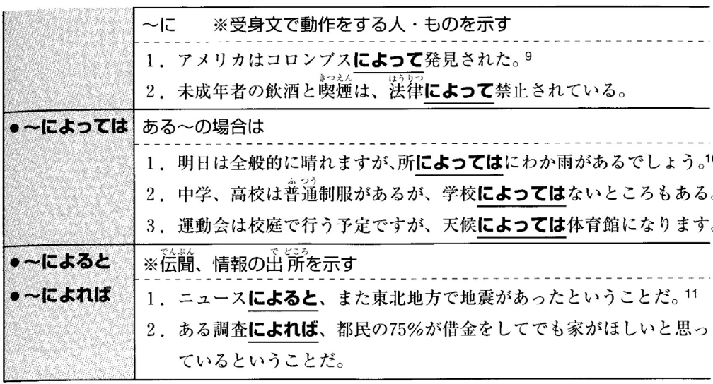
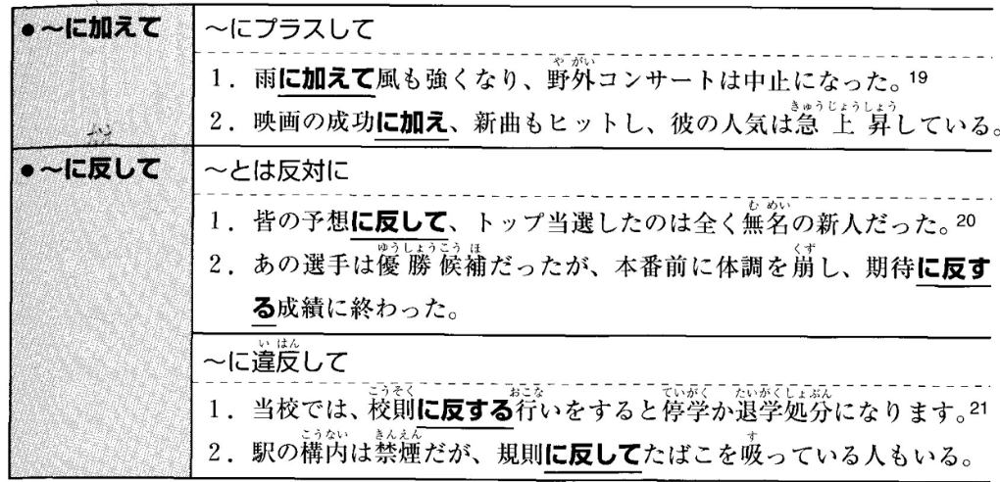

# 2

補助資料を参考に、空欄をを埋めるのに適した選択肢を選んでください。  

  
  
  
  
  
  
補助資料 1

- 
<input type="radio" name="1" value="1">
<input type="radio" name="1" value="2">
<input type="radio" name="1" value="3">
<input type="radio" name="1" value="4">

- 
<input type="radio" name="2" value="1">
<input type="radio" name="2" value="2">
<input type="radio" name="2" value="3">
<input type="radio" name="2" value="4">

- 
<input type="radio" name="3" value="1">
<input type="radio" name="3" value="2">
<input type="radio" name="3" value="3">
<input type="radio" name="3" value="4">

- 
<input type="radio" name="4" value="1">
<input type="radio" name="4" value="2">
<input type="radio" name="4" value="3">
<input type="radio" name="4" value="4">

- 
<input type="radio" name="5" value="1">
<input type="radio" name="5" value="2">
<input type="radio" name="5" value="3">
<input type="radio" name="5" value="4">

- 
<input type="radio" name="6" value="1">
<input type="radio" name="6" value="2">
<input type="radio" name="6" value="3">
<input type="radio" name="6" value="4">

- 
<input type="radio" name="7" value="1">
<input type="radio" name="7" value="2">
<input type="radio" name="7" value="3">
<input type="radio" name="7" value="4">

- 
<input type="radio" name="8" value="1">
<input type="radio" name="8" value="2">
<input type="radio" name="8" value="3">
<input type="radio" name="8" value="4">

  
  
  
  
  
  
補助資料 2

- 
<input type="radio" name="9" value="1">
<input type="radio" name="9" value="2">
<input type="radio" name="9" value="3">
<input type="radio" name="9" value="4">

- 
<input type="radio" name="a" value="1">
<input type="radio" name="a" value="2">
<input type="radio" name="a" value="3">
<input type="radio" name="a" value="4">

- 
<input type="radio" name="b" value="1">
<input type="radio" name="b" value="2">
<input type="radio" name="b" value="3">
<input type="radio" name="b" value="4">

- 
<input type="radio" name="c" value="1">
<input type="radio" name="c" value="2">
<input type="radio" name="c" value="3">
<input type="radio" name="c" value="4">

- 
<input type="radio" name="d" value="1">
<input type="radio" name="d" value="2">
<input type="radio" name="d" value="3">
<input type="radio" name="d" value="4">

- 
<input type="radio" name="e" value="1">
<input type="radio" name="e" value="2">
<input type="radio" name="e" value="3">
<input type="radio" name="e" value="4">

- 
<input type="radio" name="f" value="1">
<input type="radio" name="f" value="2">
<input type="radio" name="f" value="3">
<input type="radio" name="f" value="4">

- 
<input type="radio" name="g" value="1">
<input type="radio" name="g" value="2">
<input type="radio" name="g" value="3">
<input type="radio" name="g" value="4">

  
  
  
  
  
  
補助資料 3

- 
<input type="radio" name="h" value="1">
<input type="radio" name="h" value="2">
<input type="radio" name="h" value="3">
<input type="radio" name="h" value="4">

- 
<input type="radio" name="i" value="1">
<input type="radio" name="i" value="2">
<input type="radio" name="i" value="3">
<input type="radio" name="i" value="4">

- 
<input type="radio" name="j" value="1">
<input type="radio" name="j" value="2">
<input type="radio" name="j" value="3">
<input type="radio" name="j" value="4">

- 
<input type="radio" name="k" value="1">
<input type="radio" name="k" value="2">
<input type="radio" name="k" value="3">
<input type="radio" name="k" value="4">

- 
<input type="radio" name="l" value="1">
<input type="radio" name="l" value="2">
<input type="radio" name="l" value="3">
<input type="radio" name="l" value="4">

- 
<input type="radio" name="m" value="1">
<input type="radio" name="m" value="2">
<input type="radio" name="m" value="3">
<input type="radio" name="m" value="4">

- 
<input type="radio" name="n" value="1">
<input type="radio" name="n" value="2">
<input type="radio" name="n" value="3">
<input type="radio" name="n" value="4">

- 
<input type="radio" name="o" value="1">
<input type="radio" name="o" value="2">
<input type="radio" name="o" value="3">
<input type="radio" name="o" value="4">

<button type="button" onclick="location.href='./2'">送信</button>
