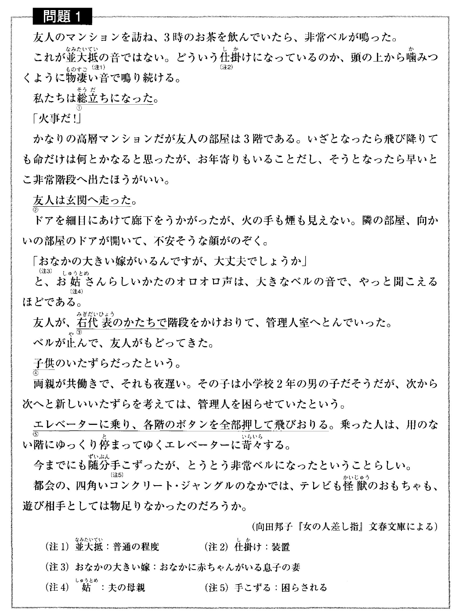

# 3

補助資料を参考に、空欄をを埋めるのに適した選択肢を選んでください。  

補助資料 1

- 筆者がこの子供に対して持っている気持ちとして、最も適当なものはどれか。  
<input type="radio" name="n" value="1">ひどいいたずらをする悪い子供だ。  
<input type="radio" name="n" value="2">もっとおもしろいおもちゃを買ってあげたい。  
<input type="radio" name="n" value="3">マンションで育てるのはよくない。  
<input type="radio" name="n" value="4">相手をしてくれる人がほしいんじゃないだろうか。  

<button type="button" onclick="location.href='./4'">送信</button>
