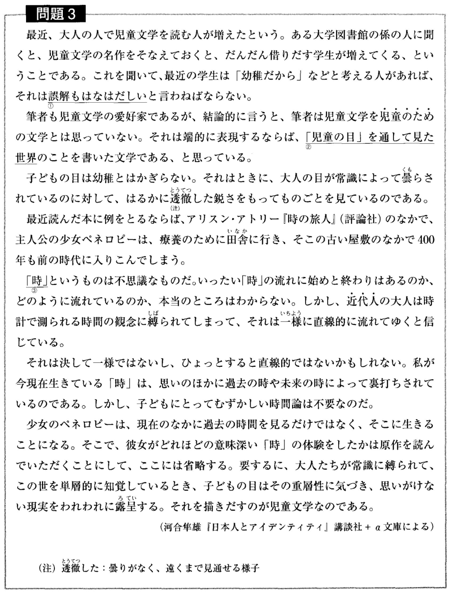
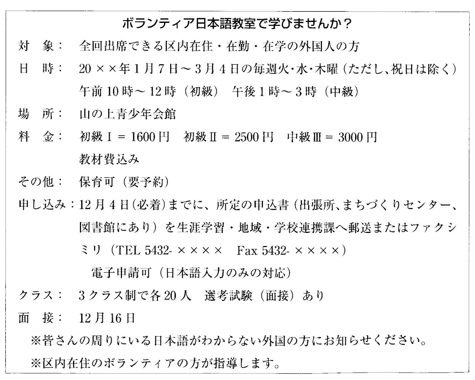
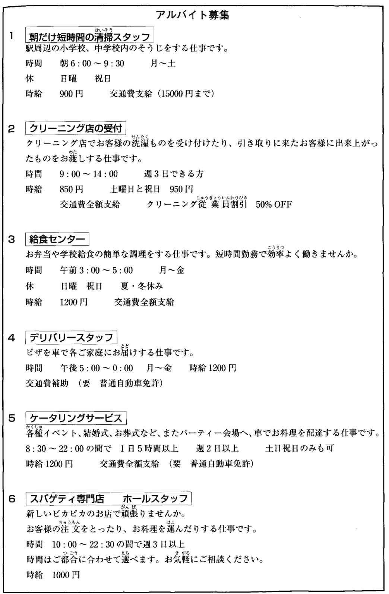
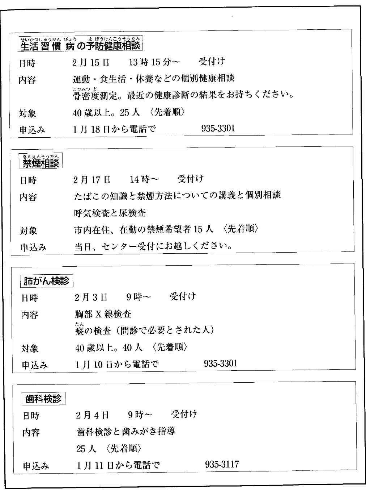

# 2

資料を参考に、適した選択肢を選んでください。  

資料 1
 
 

- 資料1に関して、筆者がこの子供に対して持っている気持ちとして、最も適当なものはどれか。  
<input type="radio" name="0" value="1">ひどいいたずらをする悪い子供だ。  
<input type="radio" name="0" value="2">もっとおもしろいおもちゃを買ってあげたい。  
<input type="radio" name="0" value="3">マンションで育てるのはよくない。  
<input type="radio" name="0" value="4">相手をしてくれる人がほしいんじゃないだろうか。  
 
 
 
 

資料 2
 
 

- 資料2に関して、筆者によると、児童文学とはどういうものか。  
<input type="radio" name="1" value="1">子どもの目を通して時間の重層性を描いたもの  
<input type="radio" name="1" value="2">子どもの目を通して大人の気づかない世界を描いたもの  
<input type="radio" name="1" value="3">子どもに不思議な世界を体験させるように書いたもの  
<input type="radio" name="1" value="4">子どもたちが楽しんで読めるように工夫して書いたもの  
 
 
 
 

資料 3
 
 

- 資料3に関して、この教室に参加を申し込みたい人は、まず何をしなければならないか。  
<input type="radio" name="2" value="1">区役所に電話をする。  
<input type="radio" name="2" value="2">外国人に知らせる。  
<input type="radio" name="2" value="3">申し込み用紙をもらいに行く。  
<input type="radio" name="2" value="4">ファックスをする。  

- 資料3に関して、内容にあっているのはどれか。  
<input type="radio" name="3" value="1">料金にテキスト代は含まれない。  
<input type="radio" name="3" value="2">小さい子どもがいても参加できる。  
<input type="radio" name="3" value="3">希望すれば誰でも参加できる。  
<input type="radio" name="3" value="4">参加者は区内に住む外国人に限る。  
 
 
 
 

資料 4
 
 

- 資料4に関して、大学生のAさんは、月曜日から金曜日まで、9時から4時まで授業がある。土曜日と日曜日は休みである。Aさんが働くことができる仕事はいくつあるか。  
<input type="radio" name="4" value="1">2つ  
<input type="radio" name="4" value="2">3つ  
<input type="radio" name="4" value="3">4つ  
<input type="radio" name="4" value="4">5つ  

- 資料4に関して、Aさんは、時給は1000円以上欲しいと思っている。しかし、朝暗いうちから仕事をするのはちょっと無理だと思う。車の運転免許を持っている。Aさんの条件に合っている仕事はどれか。  
<input type="radio" name="5" value="1">朝だけ短時間の清掃スタッフ　と　デリバリースタッフ  
<input type="radio" name="5" value="2">クリーニング店の受付　と　ケータリングサービス  
<input type="radio" name="5" value="3">スパゲティ専門店　と　給食センター  
<input type="radio" name="5" value="4">デリバリースタッフ　と　ケータルングサービス  
 
 
 
 

資料 5
 
 

- 資料5に関して、Aさんは50歳である。最近階段を上がり下がりする時、ひざが痛くて困っている。
また、体重が増えすだと思っている。日常生活のしかたについて相談したい。どうしたらいいか。  
<input type="radio" name="6" value="1">2月4日の10時にセンターの受付に行って申し込む。  
<input type="radio" name="6" value="2">1月18日に935-3301に電話して申し込む。  
<input type="radio" name="6" value="3">1月18日に、最近の健康診断の結果を持って、センターに行く。  
<input type="radio" name="6" value="4">1月10日に935-3301に電話して相談する。  

- 資料5に関して、市内の会社に勤めているBさんはたばこをたくさん吸っているので、
肺がんになるのではないかと心配している。禁煙したいので、禁煙する方法を学びたいと思う。どうしたらいいか。  
<input type="radio" name="7" value="1">2月17日の14時にセンターの受付に行って申し込む。  
<input type="radio" name="7" value="2">2月3日の9時にセンターの受付に行って申し込む。  
<input type="radio" name="7" value="3">1月10日に935-3301に電話して申し込む。  
<input type="radio" name="7" value="4">対象者ではないので、申し込むことはできない。  

<button type="button" onclick="location.href='./thanks'">送信</button>
