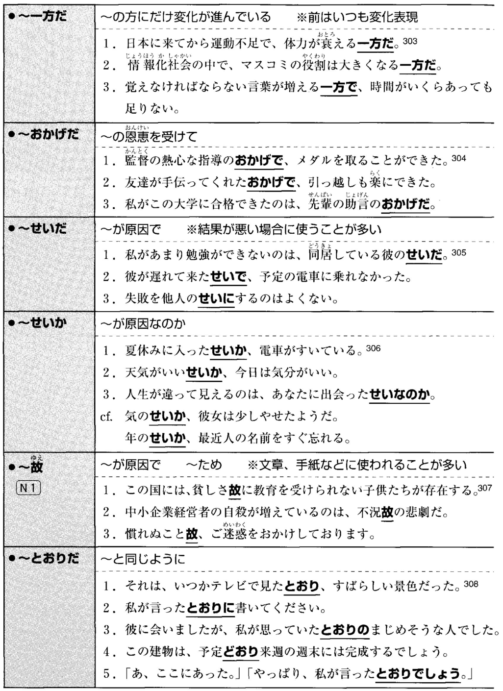
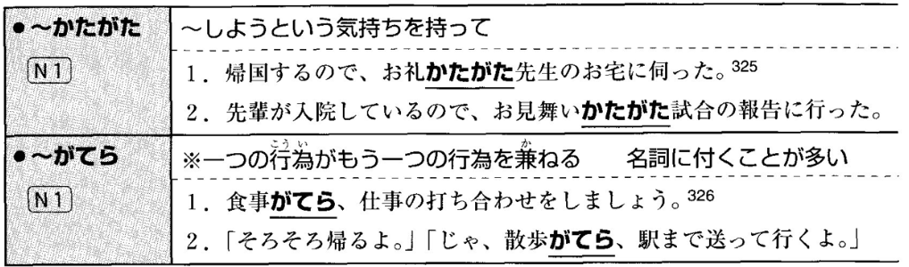
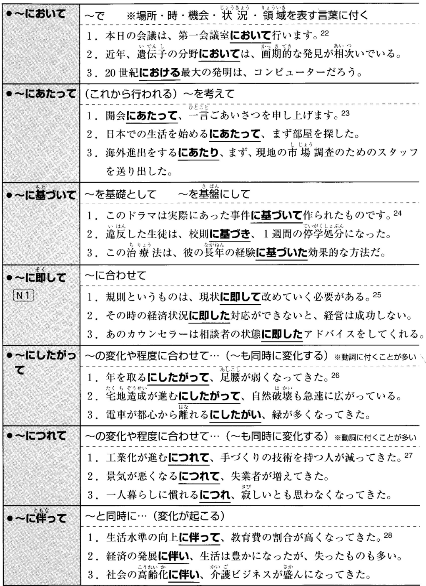
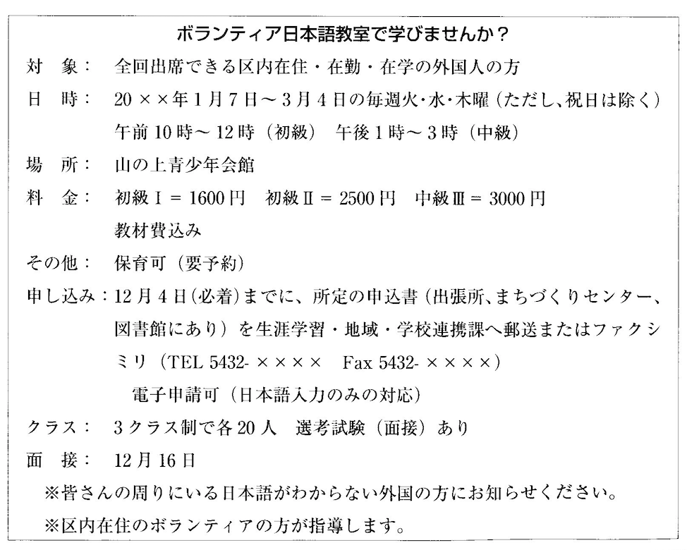

# 1

資料を参考に、空欄をを埋めるのに適した選択肢を選んでください。  

  
  
  
  
  
  
資料 2

- この病気は広い地域に伝染する \_\_\_\_\_ があるから、早く手を打たなければならない。  
<input type="radio" name="9" value="1" id="91"><label for="91">きらい   </label>  
<input type="radio" name="9" value="2" id="92"><label for="92">故</label>  
<input type="radio" name="9" value="3" id="93"><label for="93">おそれ</label>  
<input type="radio" name="9" value="4" id="94"><label for="94">始末</label>  

- 日本は経済的発展を追求する \_\_\_\_\_ 環境保護対策が遅れてしまった。  
<input type="radio" name="a" value="1" id="a1"><label for="a1">くせに</label>  
<input type="radio" name="a" value="2" id="a2"><label for="a2">なりに</label>  
<input type="radio" name="a" value="3" id="a3"><label for="a3">かたがた</label>  
<input type="radio" name="a" value="4" id="a4"><label for="a4">あまり </label>  

- 世界平和を実現できるかどうかは、私たち人間 \_\_\_\_\_ なのです。  
<input type="radio" name="b" value="1" id="b1"><label for="b1">始末</label>  
<input type="radio" name="b" value="2" id="b2"><label for="b2">次第</label>  
<input type="radio" name="b" value="3" id="b3"><label for="b3">一方</label>  
<input type="radio" name="b" value="4" id="b4"><label for="b4">故に</label>  

- 人から見るとのんびりしているようでも、彼は彼 \_\_\_\_\_ がんばっているのだ。  
<input type="radio" name="c" value="1" id="c1"><label for="c1">なりに</label>  
<input type="radio" name="c" value="2" id="c2"><label for="c2">わりに </label>  
<input type="radio" name="c" value="3" id="c3"><label for="c3">かわりに</label>  
<input type="radio" name="c" value="4" id="c4"><label for="c4">ぬきに</label>  

- 彼は問題解決のための努力を何もしていない \_\_\_\_\_ 、口だけは出す。  
<input type="radio" name="d" value="1" id="d1"><label for="d1">せいで</label>  
<input type="radio" name="d" value="2" id="d2"><label for="d2">せいか</label>  
<input type="radio" name="d" value="3" id="d3"><label for="d3">くせに</label>  
<input type="radio" name="d" value="4" id="d4"><label for="d4">とおり</label>  

- 雨が降っている \_\_\_\_\_ 、今日はお客様が少ないですね。  
<input type="radio" name="e" value="1" id="e1"><label for="e1">せいか</label>  
<input type="radio" name="e" value="2" id="e2"><label for="e2">なりに</label>  
<input type="radio" name="e" value="3" id="e3"><label for="e3">くせに</label>  
<input type="radio" name="e" value="4" id="e4"><label for="e4">とおり</label>  

- 勉強しているつもりなのに、成績が \_\_\_\_\_ 一方だ。  
<input type="radio" name="f" value="1" id="f1"><label for="f1">悪い</label>  
<input type="radio" name="f" value="2" id="f2"><label for="f2">下がる</label>  
<input type="radio" name="f" value="3" id="f3"><label for="f3">下げる</label>  
<input type="radio" name="f" value="4" id="f4"><label for="f4">下がった</label>  

- どこのキャンパスも桜が満開らしい。花見 \_\_\_\_\_ 大学の見学でもして来よう。  
<input type="radio" name="g" value="1" id="g1"><label for="g1">次第で</label>  
<input type="radio" name="g" value="2" id="g2"><label for="g2">なりに</label>  
<input type="radio" name="g" value="3" id="g3"><label for="g3">とおり</label>  
<input type="radio" name="g" value="4" id="g4"><label for="g4">がてら</label>  

  
  
  
  
  
  
資料 3

- このレストランはあまりきれいとは言えないが、味 \_\_\_\_\_ はこの辺では一番だ。  
<input type="radio" name="h" value="1" id="h1"><label for="h1">として</label>  
<input type="radio" name="h" value="2" id="h2"><label for="h2">にかけて</label>  
<input type="radio" name="h" value="3" id="h3"><label for="h3">につれて</label>  
<input type="radio" name="h" value="4" id="h4"><label for="h4">に沿って</label>  

- 会社の規模が拡大するに \_\_\_\_\_ 、以前のような家庭的な雰囲気はなくなってきた。  
<input type="radio" name="i" value="1" id="i1"><label for="i1">したがって</label>  
<input type="radio" name="i" value="2" id="i2"><label for="i2">ともに</label>  
<input type="radio" name="i" value="3" id="i3"><label for="i3">あたって</label>  
<input type="radio" name="i" value="4" id="i4"><label for="i4">比べ</label>  

- 国土開発に \_\_\_\_\_ 自然破壊をこれ以上進ませてはならない。  
<input type="radio" name="j" value="1" id="j1"><label for="j1">基づく</label>  
<input type="radio" name="j" value="2" id="j2"><label for="j2">伴う</label>  
<input type="radio" name="j" value="3" id="j3"><label for="j3">反する</label>  
<input type="radio" name="j" value="4" id="j4"><label for="j4">通じる</label>  

- では、パンフレットに \_\_\_\_\_ 説明をしていきます。  
<input type="radio" name="k" value="1" id="k1"><label for="k1">沿って</label>  
<input type="radio" name="k" value="2" id="k2"><label for="k2">応じて</label>  
<input type="radio" name="k" value="3" id="k3"><label for="k3">つれて</label>  
<input type="radio" name="k" value="4" id="k4"><label for="k4">至って</label>  

- このビールはアルコール度が低いお酒 \_\_\_\_\_ ジュースという感じだ。  
<input type="radio" name="l" value="1" id="l1"><label for="l1">にもまして</label>  
<input type="radio" name="l" value="2" id="l2"><label for="l2">と相まって</label>  
<input type="radio" name="l" value="3" id="l3"><label for="l3">に代わって</label>  
<input type="radio" name="l" value="4" id="l4"><label for="l4">というより</label>  

- 彼女の作品には、優れた技術に \_\_\_\_\_ 若々しさも感じられる。  
<input type="radio" name="m" value="1" id="m1"><label for="m1">通して</label>  
<input type="radio" name="m" value="2" id="m2"><label for="m2">加えて</label>  
<input type="radio" name="m" value="3" id="m3"><label for="m3">込めて</label>  
<input type="radio" name="m" value="4" id="m4"><label for="m4">対して</label>  

- 調査の結果は、我々の予想に \_\_\_\_\_ あまり望ましいものではなかった。  
<input type="radio" name="n" value="1" id="n1"><label for="n1">応じて</label>  
<input type="radio" name="n" value="2" id="n2"><label for="n2">伴って</label>  
<input type="radio" name="n" value="3" id="n3"><label for="n3">通じて</label>  
<input type="radio" name="n" value="4" id="n4"><label for="n4">反して</label>  

- わが社では新しい商品の開発を進める \_\_\_\_\_ 、研究者の育成にも力を入れている。  
<input type="radio" name="o" value="1" id="o1"><label for="o1">とともに</label>  
<input type="radio" name="o" value="2" id="o2"><label for="o2">につれて</label>  
<input type="radio" name="o" value="3" id="o3"><label for="o3">において</label>  
<input type="radio" name="o" value="4" id="o4"><label for="o4">に沿って</label>  

# 2

資料を参考に、適した選択肢を選んでください。  

資料 1
 
 

- 資料1に関して、筆者がこの子供に対して持っている気持ちとして、最も適当なものはどれか。  
<input type="radio" name="0" value="1" id="01"><label for="01">ひどいいたずらをする悪い子供だ。</label>  
<input type="radio" name="0" value="2" id="02"><label for="02">もっとおもしろいおもちゃを買ってあげたい。</label>  
<input type="radio" name="0" value="3" id="03"><label for="03">マンションで育てるのはよくない。</label>  
<input type="radio" name="0" value="4" id="04"><label for="04">相手をしてくれる人がほしいんじゃないだろうか。</label>  
 
 
 
 

資料 2
 
 

- 資料2に関して、筆者によると、児童文学とはどういうものか。  
<input type="radio" name="1" value="1" id="11"><label for="11">子どもの目を通して時間の重層性を描いたもの</label>  
<input type="radio" name="1" value="2" id="12"><label for="12">子どもの目を通して大人の気づかない世界を描いたもの</label>  
<input type="radio" name="1" value="3" id="13"><label for="13">子どもに不思議な世界を体験させるように書いたもの</label>  
<input type="radio" name="1" value="4" id="14"><label for="14">子どもたちが楽しんで読めるように工夫して書いたもの</label>  
 
 
 
 

資料 3
 
 

- 資料3に関して、この教室に参加を申し込みたい人は、まず何をしなければならないか。  
<input type="radio" name="2" value="1" id="21"><label for="21">区役所に電話をする。</label>  
<input type="radio" name="2" value="2" id="22"><label for="22">外国人に知らせる。</label>  
<input type="radio" name="2" value="3" id="23"><label for="23">申し込み用紙をもらいに行く。</label>  
<input type="radio" name="2" value="4" id="24"><label for="24">ファックスをする。</label>  

- 資料3に関して、内容にあっているのはどれか。  
<input type="radio" name="3" value="1" id="31"><label for="31">料金にテキスト代は含まれない。</label>  
<input type="radio" name="3" value="2" id="32"><label for="32">小さい子どもがいても参加できる。</label>  
<input type="radio" name="3" value="3" id="33"><label for="33">希望すれば誰でも参加できる。</label>  
<input type="radio" name="3" value="4" id="34"><label for="34">参加者は区内に住む外国人に限る。</label>  
 
 
 
 

資料 4
 
 

- 資料4に関して、大学生のAさんは、月曜日から金曜日まで、9時から4時まで授業がある。土曜日と日曜日は休みである。Aさんが働くことができる仕事はいくつあるか。  
<input type="radio" name="4" value="1" id="41"><label for="41">2つ</label>  
<input type="radio" name="4" value="2" id="42"><label for="42">3つ</label>  
<input type="radio" name="4" value="3" id="43"><label for="43">4つ</label>  
<input type="radio" name="4" value="4" id="44"><label for="44">5つ</label>  

- 資料4に関して、Aさんは、時給は1000円以上欲しいと思っている。しかし、朝暗いうちから仕事をするのはちょっと無理だと思う。車の運転免許を持っている。Aさんの条件に合っている仕事はどれか。  
<input type="radio" name="5" value="1" id="51"><label for="51">朝だけ短時間の清掃スタッフ　と　デリバリースタッフ</label>  
<input type="radio" name="5" value="2" id="52"><label for="52">クリーニング店の受付　と　ケータリングサービス</label>  
<input type="radio" name="5" value="3" id="53"><label for="53">スパゲティ専門店　と　給食センター</label>  
<input type="radio" name="5" value="4" id="54"><label for="54">デリバリースタッフ　と　ケータリングサービス</label>  
 
 
 
 

資料 5
 
 

- 資料5に関して、Aさんは50歳である。最近階段を上がり下がりする時、ひざが痛くて困っている。
また、体重が増えすぎだと思っている。日常生活のしかたについて相談したい。どうしたらいいか。  
<input type="radio" name="6" value="1" id="61"><label for="61">2月4日の10時にセンターの受付に行って申し込む。</label>  
<input type="radio" name="6" value="2" id="62"><label for="62">1月18日に935-3301に電話して申し込む。</label>  
<input type="radio" name="6" value="3" id="63"><label for="63">1月18日に、最近の健康診断の結果を持って、センターに行く。</label>  
<input type="radio" name="6" value="4" id="64"><label for="64">1月10日に935-3301に電話して相談する。</label>  

- 資料5に関して、市内の会社に勤めているBさんはたばこをたくさん吸っているので、
肺がんになるのではないかと心配している。禁煙したいので、禁煙する方法を学びたいと思う。どうしたらいいか。  
<input type="radio" name="7" value="1" id="71"><label for="71">2月17日の14時にセンターの受付に行って申し込む。</label>  
<input type="radio" name="7" value="2" id="72"><label for="72">2月3日の9時にセンターの受付に行って申し込む。</label>  
<input type="radio" name="7" value="3" id="73"><label for="73">1月10日に935-3301に電話して申し込む。</label>  
<input type="radio" name="7" value="4" id="74"><label for="74">対象者ではないので、申し込むことはできない。</label>  
